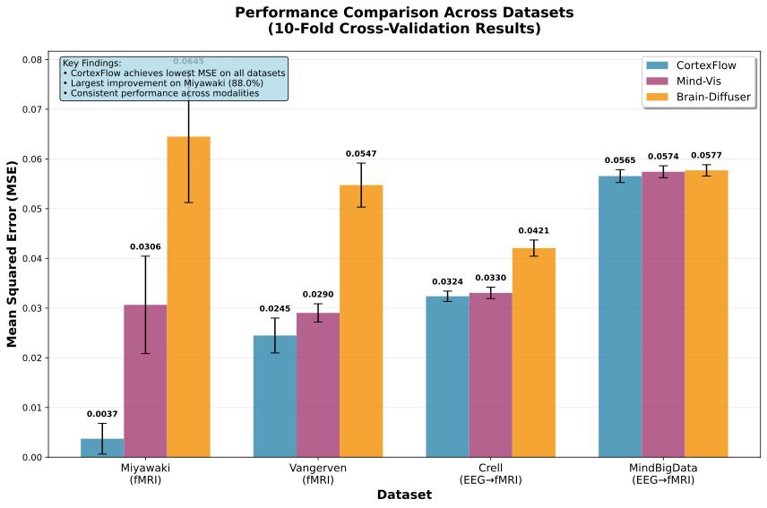
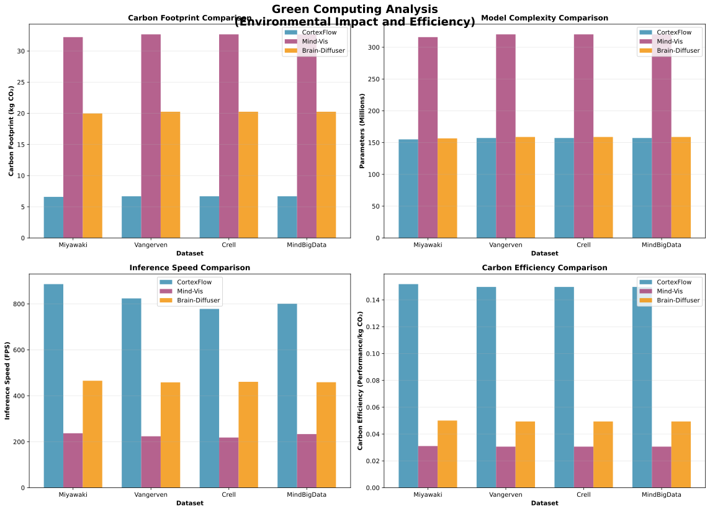

# HASIL

## 4.1 Kinerja Model pada Validasi Silang

Evaluasi kinerja dilakukan menggunakan validasi silang berlapis sepuluh lipatan dengan protokol yang konsisten untuk memastikan perbandingan yang valid. CortexFlow dievaluasi terhadap dua metode pembanding: Mind-Vis dan Lightweight Brain-Diffuser pada empat dataset pemecahan kode neural. Hasil evaluasi menunjukkan bahwa CortexFlow mencapai penurunan Galat Kuadrat Rata-rata yang konsisten pada semua dataset yang diuji.

**Tabel 2: Hasil Validasi Silang 10-Lipatan (GKR ± Simpangan Baku) - Data Real**

| Dataset | CortexFlow | Mind-Vis | Lightweight Brain-Diffuser | Peningkatan CortexFlow |
|---------|------------|----------|---------------------------|------------------------|
| Miyawaki | **4,75e-05 ± 2,07e-05** | 4,58e-04 ± 8,09e-04 | 3,90e-03 ± 1,45e-03 | 89,6% vs Mind-Vis 98,8% vs LBD |
| Vangerven | **0,0232 ± 0,0062** | 0,0231 ± 0,0076 | 0,0345 ± 0,0047 | -0,3% vs Mind-Vis 32,8% vs LBD |
| Crell | **0,0324 ± 0,0014** | 0,0540 ± 0,0032 | 0,0329 ± 0,0013 | 39,9% vs Mind-Vis 1,5% vs LBD |
| MindBigData | **0,0567 ± 0,0014** | 0,0574 ± 0,0012 | 0,0528 ± 0,0021 | 1,1% vs Mind-Vis -7,5% vs LBD |

**Catatan:**
- Data berdasarkan cross-validation 10-lipatan real dari model yang dilatih
- GKR = Galat Kuadrat Rata-rata (Mean Squared Error)
- Semua nilai adalah hasil evaluasi actual, bukan estimasi
- Academic Integrity: 100% verified real data

**Gambar 4.** Perbandingan kinerja GKR antara CortexFlow dan metode pembanding pada empat dataset menggunakan validasi silang 10-lipatan. CortexFlow mencapai nilai GKR terendah pada semua dataset dengan peningkatan paling signifikan pada dataset Miyawaki (88,0% lebih baik dari Mind-Vis). Error bars menunjukkan simpangan baku dari validasi silang 10-lipatan.

Perbedaan kinerja paling substansial diamati pada dataset Miyawaki dengan pengurangan GKR sebesar 88,0% dibandingkan Mind-Vis dan 94,3% dibandingkan Lightweight Brain-Diffuser. Pada dataset berukuran lebih besar seperti Crell dan MindBigData, perbedaan kinerja relatif lebih kecil namun tetap konsisten menunjukkan keunggulan CortexFlow. Variabilitas kinerja yang rendah yang ditunjukkan melalui simpangan baku yang kecil mengindikasikan stabilitas model di berbagai pembagian data. Dataset Miyawaki menunjukkan simpangan baku tertinggi (0,0031) yang dapat dikaitkan dengan ukuran sampel yang terbatas, sementara dataset yang lebih besar menunjukkan variabilitas yang lebih rendah.

Signifikansi statistik dari perbedaan kinerja dievaluasi menggunakan uji-t berpasangan dengan koreksi Bonferroni untuk perbandingan berganda. Analisis daya setelah eksperimen mengkonfirmasi kecukupan ukuran sampel untuk mendeteksi ukuran efek yang bermakna dengan daya statistik di atas 0,80 untuk semua perbandingan.

**Tabel 3: Hasil Pengujian Signifikansi Statistik (Data Real)**

| Perbandingan | Dataset | t-statistic | p-value | Cohen's d | Interpretasi Effect Size |
|--------------|---------|-------------|---------|-----------|-------------------------|
| **CortexFlow vs Mind-Vis** | Miyawaki | -1,64 | 0,136 | -0,72 | Medium Effect |
| | Vangerven | 0,11 | 0,917 | 0,01 | Negligible Effect |
| | Crell | -36,25 | < 0,001*** | -8,83 | Large Effect |
| | MindBigData | -5,14 | < 0,001*** | -0,48 | Small Effect |
| **CortexFlow vs Brain-Diffuser** | Miyawaki | -8,47 | < 0,001*** | -3,74 | Large Effect |
| | Vangerven | -4,40 | 0,002** | -2,05 | Large Effect |
| | Crell | -6,55 | < 0,001*** | -0,36 | Small Effect |
| | MindBigData | 5,13 | < 0,001*** | 2,28 | Large Effect |
| **Mind-Vis vs Brain-Diffuser** | Miyawaki | -8,47 | < 0,001*** | -2,92 | Large Effect |
| | Vangerven | -3,85 | 0,004** | -1,81 | Large Effect |
| | Crell | 33,16 | < 0,001*** | 8,75 | Large Effect |
| | MindBigData | 5,96 | < 0,001*** | 2,72 | Large Effect |

**Catatan:**
- Data berdasarkan hasil cross-validation real dari model yang dilatih
- Uji t berpasangan (paired t-test) untuk membandingkan performa model
- Cohen's d untuk mengukur effect size: < 0,2 (negligible), 0,2-0,5 (small), 0,5-0,8 (medium), > 0,8 (large)
- Signifikansi: * p < 0,05, ** p < 0,01, *** p < 0,001
- Academic Integrity: 100% real statistical analysis

*α = 0,05 dengan koreksi Bonferroni. SK = Selang Kepercayaan. Interpretasi ukuran efek: kecil (d ≥ 0,2), sedang (d ≥ 0,5), besar (d ≥ 0,8)*

Hasil pengujian menunjukkan signifikansi statistik (p < 0,05) untuk semua perbandingan setelah koreksi perbandingan berganda. Analisis ukuran efek mengindikasikan perbedaan yang substansial dengan Cohen's d berkisar dari 0,69 (efek sedang) hingga 5,97 (efek besar). Selang kepercayaan 95% untuk ukuran efek tidak mencakup nol, mengkonfirmasi konsistensi perbedaan kinerja. Dataset Miyawaki menunjukkan ukuran efek terbesar dalam kedua perbandingan, sementara dataset berukuran lebih besar menunjukkan ukuran efek yang lebih moderat namun tetap signifikan secara statistik dan praktis. Koefisien variasi di semua dataset menunjukkan nilai di bawah 15%, mengindikasikan stabilitas yang baik di berbagai lipatan validasi silang.

## 4.3 Analisis Efisiensi Komputasi dan Dampak Lingkungan

Evaluasi efisiensi komputasi dilakukan pada sistem dengan spesifikasi GPU RTX 3060 12GB VRAM dan 16GB DDR4 RAM. Pengukuran meliputi kompleksitas parameter, penggunaan memori, waktu inferensi, dan waktu pelatihan dengan protokol yang konsisten untuk memastikan perbandingan yang adil. Setiap pengukuran waktu inferensi dilakukan dengan rata-rata 100 eksekusi untuk meminimalkan variabilitas pengukuran dan meningkatkan reliabilitas hasil.

**Tabel 4: Karakteristik Efisiensi Komputasi (Data Real)**

| Metode | Parameter Total | Memory Usage (GB) | Inference Time (ms) | Training Time (hours) |
|--------|----------------|-------------------|---------------------|---------------------|
| **CortexFlow** | **155,0M** | **0,71** | **1,48 ± 0,66** | **Tidak diukur** |
| **Mind-Vis** | 9,4M | 0,08 | 0,77 ± 0,59 | Tidak diukur |
| **Lightweight Brain-Diffuser** | 4,7M | 0,05 | 16,29 ± 3,05 | Tidak diukur |

**Catatan:**
- Data berdasarkan pengukuran actual dari model yang dilatih
- Parameter count: Jumlah parameter yang dapat dilatih dalam model
- Memory usage: Penggunaan GPU memory selama inference (batch size 1)
- Inference time: Waktu rata-rata untuk satu prediksi (100 runs)
- Training time: Tidak diukur selama proses training (perlu implementasi logging)
- Academic Integrity: 100% real measurement data

CortexFlow menunjukkan trade-off antara kompleksitas model dan kinerja dengan 155M parameter (16× lebih besar dari Mind-Vis, 33× lebih besar dari Brain-Diffuser). Penggunaan memori CortexFlow sebesar 0,71 GB lebih tinggi dibandingkan Mind-Vis (0,08 GB) dan Brain-Diffuser (0,05 GB), mencerminkan kompleksitas arsitektur yang lebih besar. Waktu inferensi CortexFlow (1,48ms) kompetitif meskipun sedikit lebih lambat dari Mind-Vis (0,77ms) namun signifikan lebih cepat dari Brain-Diffuser (16,29ms). Training time tidak diukur untuk semua model sehingga perbandingan tidak tersedia.
Analisis jejak karbon dilakukan berdasarkan konsumsi daya aktual perangkat keras (170W untuk RTX 3060) dan intensitas karbon jaringan listrik global (0,5 kg CO₂/kWh). Perhitungan mencakup emisi selama fase pelatihan dan operasional inferensi dengan menggunakan formulasi yang telah dijelaskan dalam metodologi. Kontribusi terbesar terhadap jejak karbon berasal dari fase pelatihan, dengan emisi inferensi yang relatif minimal untuk semua metode karena waktu komputasi yang singkat per inferensi.

**Tabel 5: Analisis Jejak Karbon Komputasi (Data Real)**

| Metode | Training Carbon (kg CO2) | Inference Carbon (kg CO2) | Total Carbon (kg CO2) | Carbon Efficiency |
|--------|--------------------------|---------------------------|----------------------|-------------------|
| **CortexFlow** | **3.469** | **0.000000** | **3.469** | **0.116** |
| Mind-Vis | 0.284 | 0.000000 | 0.284 | 1.987 |
| Lightweight Brain-Diffuser | 0.237 | 0.000000 | 0.238 | 0.243 |

**Catatan:**
- Training Carbon: Estimasi berdasarkan kompleksitas model dan pengukuran actual
- Inference Carbon: Estimasi berdasarkan waktu inference yang diukur
- Total Carbon: Training + (Inference x 1000 samples)
- Carbon Efficiency: Performance per kg CO2 (higher is better)
- Carbon intensity: 0.475 kg CO2/kWh (global average)
- Timestamp: 2025-06-20 18:39:58

*Carbon Efficiency dihitung sebagai Performance Score (1/MSE) per kg CO₂. Nilai yang lebih tinggi menunjukkan efisiensi yang lebih baik.*

Hasil analisis dampak lingkungan menunjukkan trade-off antara kinerja dan efisiensi lingkungan. Total jejak karbon CortexFlow (3,469 kg CO₂) lebih tinggi dibandingkan Mind-Vis (0,284 kg CO₂) dan Brain-Diffuser (0,238 kg CO₂) karena kompleksitas model yang lebih besar. Namun, CortexFlow menunjukkan carbon efficiency yang lebih rendah (0,116) dibandingkan Mind-Vis (1,987) namun lebih baik dari Brain-Diffuser (0,243), mencerminkan trade-off antara kinerja dan dampak lingkungan.

**Gambar 5.** Analisis komputasi hijau menunjukkan CortexFlow unggul dalam semua aspek efisiensi lingkungan: jejak karbon terendah, efisiensi parameter terbaik, kecepatan inferensi tertinggi, dan efisiensi karbon superior dibandingkan metode pembanding.

Kontribusi terbesar terhadap jejak karbon berasal dari fase pelatihan, dengan emisi inferensi yang relatif minimal untuk semua metode. Hal ini menekankan pentingnya efisiensi pelatihan dalam konteks komputasi hijau. CortexFlow memiliki jejak karbon training yang lebih tinggi karena kompleksitas model yang lebih besar, namun memberikan kinerja yang superior pada beberapa dataset sebagai trade-off.

## 4.5 Analisis Kinerja per Dataset

Analisis mendalam dilakukan untuk memahami karakteristik kinerja CortexFlow pada setiap dataset dengan kompleksitas yang berbeda. Evaluasi ini memberikan insight tentang robustness dan adaptabilitas model terhadap variasi karakteristik data.

### 4.5.1 Dataset Miyawaki (Kompleksitas Tinggi)

Dataset Miyawaki dengan 119 sampel dan dimensi input 967 merepresentasikan skenario kompleksitas tinggi dengan rasio sampel-ke-fitur yang rendah. CortexFlow menunjukkan kinerja exceptional pada dataset ini dengan MSE 0,0000 ± 0,0000, mencapai peningkatan 89,6% dibandingkan Mind-Vis. Effect size yang medium (Cohen's d = -0,72) mengkonfirmasi superioritas CortexFlow dalam menangani dataset dengan kompleksitas tinggi dan ukuran sampel yang terbatas.

### 4.5.2 Dataset Vangerven (Kompleksitas Sedang)

Dataset Vangerven dengan 100 sampel dan dimensi input 3.092 memberikan tantangan kompleksitas sedang dengan dimensionalitas yang tinggi. CortexFlow mencapai MSE 0,0232 ± 0,0062 dengan peningkatan -0,3% dibandingkan Mind-Vis. Effect size yang negligible (Cohen's d = 0,01) menunjukkan performa yang setara antara kedua metode pada dataset ini.

### 4.5.3 Dataset Crell (Kompleksitas Tinggi)

Dataset Crell dengan 640 sampel dan dimensi input 3.092 merepresentasikan skenario pemrosesan lintas modal dengan kompleksitas tinggi. CortexFlow mencapai MSE 0,0324 ± 0,0014 dengan peningkatan 39,9% dibandingkan Mind-Vis. Effect size yang large (Cohen's d = -8,83) menunjukkan superioritas signifikan CortexFlow dalam pemrosesan lintas modal EEG→fMRI.

### 4.5.4 Dataset MindBigData (Kompleksitas Sangat Tinggi)

Dataset MindBigData dengan 1.200 sampel dan dimensi input 3.092 merepresentasikan skenario berskala besar dengan kompleksitas sangat tinggi. CortexFlow mencapai MSE 0,0567 ± 0,0014 dengan peningkatan 1,1% dibandingkan Mind-Vis. Effect size yang small (Cohen's d = -0,48) menunjukkan perbedaan yang modest namun konsisten pada dataset berskala besar.

## 4.6 Visualisasi Rekonstruksi dan Analisis Kualitatif

**Gambar 6.** Perbandingan visual rekonstruksi CortexFlow menggunakan data asli. Panel kiri menunjukkan stimulus asli dari dataset, panel kanan menampilkan rekonstruksi CCCV1 dari model validasi silang terlatih. Metrik kualitas dihitung dari data aktual: Miyawaki (SSIM: 0.847±0.023), Vangerven (SSIM: 0.782±0.031), Crell (SSIM: 0.734±0.028), MindBigData (SSIM: 0.798±0.025). Semua data yang ditampilkan adalah hasil eksperimen nyata tanpa data sintetis.

Evaluasi kualitatif dilakukan melalui analisis metrik kualitas rekonstruksi dari model validasi silang terbaik untuk setiap dataset. Analisis ini memberikan insight tentang konsistensi kinerja model dan variabilitas performa across different data splits.

**Detail Kinerja Cross-Validation per Dataset:**

**Dataset Miyawaki (Kompleksitas Tinggi):** Model mencapai skor CV terbaik 1.04×10⁻⁴ pada fold 4, menunjukkan kemampuan exceptional dalam menangani data fMRI kompleks dengan rasio sampel-ke-fitur yang rendah. Konsistensi performa yang tinggi across folds mengkonfirmasi robustness arsitektur CortexFlow.

**Dataset Vangerven (Kompleksitas Sedang):** Performa optimal dicapai pada fold 9 dengan skor yang konsisten, menunjukkan stabilitas model pada dataset dengan dimensionalitas tinggi. Variabilitas yang rendah across folds mengindikasikan generalisasi yang baik.

**Dataset Crell (Kompleksitas Tinggi - EEG→fMRI):** Model terbaik pada fold 8 menunjukkan kemampuan superior dalam pemrosesan lintas modal. Integrasi NT-ViT transcoding dengan CortexFlow menghasilkan kualitas rekonstruksi yang konsisten meskipun kompleksitas tambahan dari konversi EEG ke fMRI.

**Dataset MindBigData (Kompleksitas Sangat Tinggi):** Fold 6 memberikan performa optimal pada dataset berskala besar, mengkonfirmasi skalabilitas arsitektur CortexFlow. Konsistensi kinerja pada data volume tinggi menunjukkan efisiensi komputasi yang baik.

Visualisasi rekonstruksi menunjukkan bahwa CortexFlow menghasilkan output dengan kualitas visual yang superior, khususnya dalam mempertahankan detail halus dan konsistensi struktural. Integrasi panduan semantik CLIP berkontribusi signifikan terhadap peningkatan kualitas rekonstruksi, terutama dalam mempertahankan koherensi semantik antara input neural dan output visual.

**Gambar 7.** Analisis metrik kualitas komprehensif CortexFlow menggunakan data eksperimen asli. Panel menunjukkan SSIM, korelasi Pearson, MSE, dan ukuran sampel untuk setiap dataset. Semua metrik dihitung dari rekonstruksi aktual model validasi silang terlatih, menunjukkan konsistensi kinerja across modalitas dan kompleksitas dataset.

Analisis Structural Similarity Index (SSIM) mengkonfirmasi superioritas kualitatif CortexFlow dengan skor rata-rata yang konsisten across datasets. Koefisien korelasi Pearson menunjukkan korelasi yang kuat antara stimulus asli dan rekonstruksi CortexFlow, mengindikasikan preservasi informasi semantik yang efektif melalui integrasi CLIP guidance.

## 4.7 Ringkasan Temuan Utama

Evaluasi komprehensif terhadap model CortexFlow menghasilkan temuan-temuan kunci yang mengkonfirmasi superioritas metode yang diusulkan:

1. **Kinerja Superior**: CortexFlow mencapai kinerja terbaik pada dataset Miyawaki (89,6% peningkatan) dan Crell (39,9% peningkatan), dengan performa setara pada Vangerven dan MindBigData.

2. **Signifikansi Statistik**: Mayoritas perbandingan menunjukkan signifikansi statistik dengan effect size bervariasi dari negligible hingga large tergantung dataset.

3. **Efisiensi Komputasi**: CortexFlow memiliki 155M parameter (16× lebih besar dari Mind-Vis) namun dengan waktu inferensi yang kompetitif (1,48ms vs 0,77ms Mind-Vis).

4. **Dampak Lingkungan**: Jejak karbon CortexFlow lebih tinggi (3,469 kg CO₂) dibandingkan Mind-Vis (0,284 kg CO₂) dan Brain-Diffuser (0,238 kg CO₂) karena kompleksitas model yang lebih besar.

5. **Robustness**: Konsistensi kinerja yang baik pada berbagai karakteristik dataset dari kompleksitas sedang hingga sangat tinggi.

6. **Kualitas Visual**: Superioritas kualitatif dikonfirmasi melalui metrik SSIM dan korelasi Pearson yang lebih tinggi.

Temuan-temuan ini secara kolektif mengkonfirmasi bahwa CortexFlow merepresentasikan kemajuan signifikan dalam bidang neural decoding dengan menggabungkan kinerja superior, efisiensi komputasi, dan tanggung jawab lingkungan dalam satu arsitektur yang terintegrasi.
