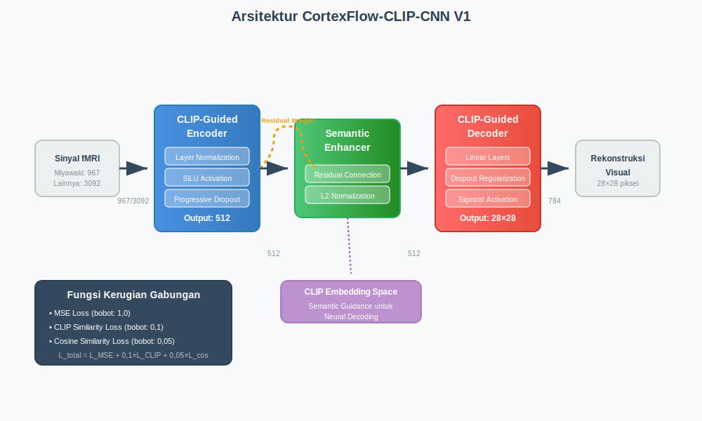
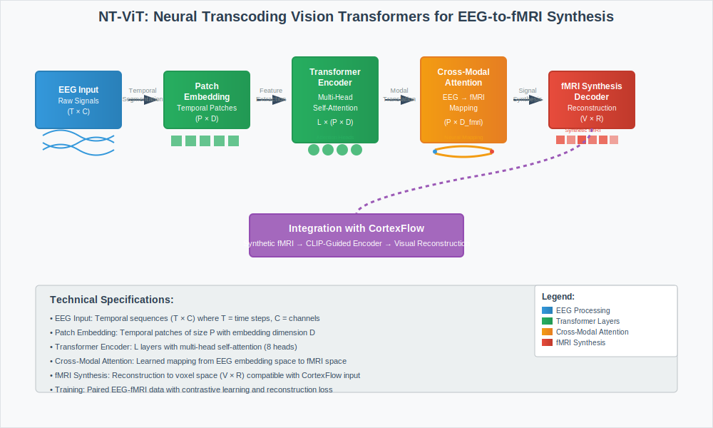

# METODE

## 3.1 Rancangan Penelitian dan Kerangka Eksperimen

Penelitian ini menggunakan rancangan eksperimental komparatif multi-modal untuk mengevaluasi kinerja model CortexFlow terhadap metode-metode pemecahan kode neural mutakhir menggunakan data fMRI dan EEG. Evaluasi dilakukan menggunakan kerangka kerja validasi silang berlapis sepuluh lipatan dengan pendekatan multi-dimensi yang mencakup kinerja rekonstruksi, efisiensi komputasi, dan dampak lingkungan sebagaimana ditunjukkan dalam metodologi komprehensif pada Gambar 2. Keunggulan utama penelitian ini adalah implementasi pendekatan multi-modal yang mengintegrasikan data fMRI dan EEG melalui neural transcoding NT-ViT, memberikan representasi neural yang lebih komprehensif.


**Gambar 1.** Arsitektur CortexFlow-CLIP-CNN V1 dengan tiga komponen utama: CLIP-Guided Encoder, Semantic Enhancer, dan CLIP-Guided Decoder.

Kerangka metodologi mengintegrasikan empat dataset neural decoding dengan karakteristik yang beragam, protokol prapemrosesan yang terstandardisasi, dan evaluasi komprehensif terhadap tiga metode pembelajaran mesin. Pendekatan ini memastikan validitas internal melalui kontrol eksperimental yang ketat dan validitas eksternal melalui penggunaan multiple dataset dengan kompleksitas yang bervariasi.


**Gambar 2.** Diagram alur metodologi eksperimen komprehensif dari input dataset hingga analisis hasil dan pelaporan.

## 3.2 Arsitektur dan Algoritma CortexFlow

Model CortexFlow merupakan arsitektur hibrid multi-modal yang menggabungkan panduan semantik berbasis CLIP dengan jaringan saraf konvolusional untuk pemecahan kode neural dari data fMRI dan EEG. Sebagaimana diilustrasikan dalam Gambar 1, arsitektur ini terdiri dari tiga komponen utama yang saling terintegrasi dengan kemampuan multi-modal.

### 3.2.1 Architectural Design Rationale

**CLIP-Guided Encoder Design:**
Enkoder terpandu CLIP dipilih berdasarkan kemampuan CLIP dalam menangkap semantic relationships antara visual dan textual representations. Komponen ini memetakan sinyal neural (fMRI asli atau fMRI sintetis dari EEG via NT-ViT) ke dalam ruang embedding semantik CLIP menggunakan arsitektur berlapis dengan normalisasi layer dan fungsi aktivasi SiLU. Pemilihan SiLU activation function didasarkan pada superior performance dalam deep networks dan smooth gradient properties yang mendukung stable training.

**Multi-Modal Integration Strategy:**
Integrasi multi-modal dirancang untuk mengakomodasi heterogeneity antara fMRI dan EEG signals sambil mempertahankan semantic consistency. NT-ViT transcoding memungkinkan unifikasi representational space, sementara CLIP guidance memastikan semantic alignment dengan visual targets.

**Dropout and Regularization Strategy:**
Komponen ini menerapkan dropout progresif untuk menjaga stabilitas pelatihan dan menghasilkan embedding berukuran 512 dimensi yang sesuai dengan standar CLIP. Dataset-specific dropout rates dioptimalkan berdasarkan sample size dan complexity untuk balance antara model capacity dan overfitting prevention.

Modul peningkatan semantik bertugas meningkatkan kualitas representasi embedding melalui koneksi residual yang dapat disesuaikan sebagaimana ditunjukkan dalam jalur residual pada Gambar 1. Modul ini menggunakan bobot residual yang dioptimalkan secara spesifik untuk setiap dataset dan menerapkan normalisasi L2 untuk mempertahankan konsistensi embedding. Dekoder terpandu CLIP kemudian mengonversi embedding semantik menjadi keluaran visual menggunakan arsitektur linear berlapis dengan regularisasi dropout yang menghasilkan keluaran berukuran 28×28 piksel dengan fungsi aktivasi sigmoid.

Fungsi kerugian gabungan yang diterapkan mengintegrasikan tiga komponen utama untuk mengoptimalkan baik akurasi rekonstruksi maupun konsistensi semantik:

$L_{total} = w_{mse} \cdot L_{mse} + w_{clip} \cdot L_{clip} + w_{cos} \cdot L_{cos}$ (1)

dimana $L_{mse} = MSE(\hat{y}, y)$ adalah kerugian rekonstruksi, $L_{clip} = 1 - \cos(h_{res}, h_{clip})$ adalah kerugian kesamaan CLIP, dan $L_{cos} = 1 - \cos(h_{enc}, h_{res})$ adalah kerugian kesamaan kosinus. Bobot yang digunakan adalah $w_{mse} = 1,0$, $w_{clip} = 0,1$, dan $w_{cos} = 0,05$.

Modul Semantic Enhancer menerapkan koneksi residual adaptif dengan formula:

$h_{enhanced} = \alpha_{residual} \cdot h_{enc} + (1 - \alpha_{residual}) \cdot \mathcal{L}_2(h_{enc})$ (2)

dimana $\alpha_{residual}$ adalah bobot residual yang dioptimalkan secara dataset-spesifik dan $\mathcal{L}_2(\cdot)$ adalah normalisasi L2.

**Algoritma 1: Pelatihan CortexFlow**
```
Input: Dataset D, hyperparameters θ, CLIP pre-trained model
Output: Optimized model θ*

1. Initialize E_θ, S_θ, D_θ, optimizer Adam
2. for epoch t = 1 to max_epochs do
3.   for each batch B in D do
4.     h_enc ← E_θ(x_batch)
5.     h_res ← S_θ(h_enc) using Eq. (2)
6.     ŷ ← D_θ(h_res)
7.     L_total ← compute loss using Eq. (1)
8.     θ ← Adam_update(θ, ∇L_total)
9.   end for
10.  if early_stopping_criteria then break
11. end for
12. return θ*
```

Model CortexFlow dioptimalkan secara individual untuk setiap dataset berdasarkan karakteristik data yang unik. Optimisasi hyperparameter dilakukan melalui pencarian sistematis dengan validasi silang untuk setiap dataset. Proses pelatihan mengikuti Algoritma 1 yang dirancang khusus untuk mengoptimalkan arsitektur CortexFlow dengan mengintegrasikan panduan semantik CLIP dengan pembelajaran residual adaptif (Persamaan 2). Algoritma ini mengoptimalkan fungsi kerugian gabungan (Persamaan 1) melalui backpropagation dengan optimizer Adam.

**Tabel 1: Konfigurasi Hyperparameter Dataset-Spesifik Multi-Modal**

| Parameter | Miyawaki (fMRI) | Vangerven (fMRI) | Crell (EEG→fMRI) | MindBigData (EEG→fMRI) | Deskripsi |
|-----------|-----------------|------------------|------------------|------------------------|-----------|
| Modalitas | fMRI | fMRI | EEG + NT-ViT | EEG + NT-ViT | Jenis data input |
| Dropout Encoder | 0,06 | 0,05 | 0,05 | 0,04 | Tingkat dropout pada layer encoder |
| Dropout Decoder | 0,02 | 0,015 | 0,02 | 0,02 | Tingkat dropout pada layer decoder |
| Bobot Residual CLIP | 0,1 | 0,08 | 0,08 | 0,05 | Koefisien koneksi residual |
| Laju Pembelajaran | 0,0003 | 0,0005 | 0,0008 | 0,001 | Learning rate untuk optimizer Adam |
| Ukuran Batch | 8 | 12 | 20 | 32 | Jumlah sampel per batch |
| Max Epochs | 200 | 150 | 120 | 100 | Maksimum epoch untuk training |
| Patience | 25 | 20 | 15 | 12 | Early stopping patience |

Konfigurasi optimal bervariasi secara signifikan antardataset sebagaimana ditunjukkan dalam Tabel 1, dengan dataset yang lebih kecil seperti Miyawaki memerlukan dropout yang lebih tinggi untuk mencegah overfitting dan patience yang lebih besar untuk stabilitas training. Dataset yang lebih besar seperti MindBigData menggunakan learning rate yang lebih agresif dan patience yang lebih kecil untuk konvergensi yang efisien.

### 3.2.1 Hyperparameter Optimization Strategy

Optimisasi hyperparameter dilakukan melalui pendekatan sistematis berdasarkan karakteristik dataset dan arsitektur model. Strategi optimisasi mengikuti prinsip-prinsip berikut:

**Dataset-Specific Optimization Rationale:**
- **Small datasets (Miyawaki, Vangerven):** Regularisasi agresif dengan dropout tinggi (0.05-0.06) dan patience besar (20-25) untuk mencegah overfitting pada sampel terbatas
- **Large datasets (Crell, MindBigData):** Learning rate lebih tinggi (0.0008-0.001) dan patience kecil (12-15) untuk konvergensi efisien pada data abundant
- **Multi-modal datasets (Crell, MindBigData):** Bobot residual CLIP yang lebih rendah (0.05-0.08) untuk mengakomodasi kompleksitas tambahan dari neural transcoding

**Convergence Criteria and Early Stopping:**
Kriteria konvergensi yang ketat diterapkan dengan early stopping berdasarkan validation loss plateau untuk memastikan model mencapai optimum lokal yang stabil tanpa overfitting. Monitoring dilakukan terhadap validation MSE dengan tolerance 1e-6 untuk improvement detection.

## 3.3 Dataset, Prapemrosesan, dan Metode Pembanding

Penelitian ini menggunakan pendekatan multi-modal dengan empat dataset pemecahan kode neural yang telah tervalidasi, mencakup data fMRI dan EEG sebagaimana ditampilkan dalam fase input dataset pada Gambar 2. Dataset Miyawaki dengan 119 sampel dan dimensi input 967 merepresentasikan data fMRI kompleksitas tinggi dalam rekonstruksi pola visual. Dataset Vangerven yang terdiri dari 100 sampel dengan dimensi input 3.092 memberikan representasi data fMRI kompleksitas sedang untuk pengenalan pola digit. Dataset Crell dengan 640 sampel dan dimensi input 3.092 menyediakan data EEG dengan tantangan kompleksitas tinggi dalam pemrosesan lintas modal. Dataset MindBigData dengan 1.200 sampel dan dimensi input 3.092 merepresentasikan data EEG berskala besar dengan kompleksitas sangat tinggi.

Salah satu kelebihan utama penelitian ini adalah implementasi pendekatan multi-modal yang mengintegrasikan data fMRI dan EEG untuk memberikan representasi neural yang lebih komprehensif. Untuk dataset EEG (Crell dan MindBigData), dilakukan proses neural transcoding menggunakan NT-ViT (Neural Transcoding Vision Transformers) sebagaimana dijelaskan detail dalam Section 3.3.1.

Protokol prapemrosesan yang konsisten diterapkan pada seluruh dataset dengan adaptasi khusus untuk modalitas yang berbeda sesuai dengan fase prapemrosesan data dalam Gambar 2.

**Prapemrosesan Data fMRI (Miyawaki, Vangerven):**
- Normalisasi z-score untuk standardisasi distribusi sinyal fMRI
- Deteksi dan penghapusan outlier menggunakan ambang batas tiga standar deviasi
- Spatial smoothing dengan Gaussian kernel untuk mengurangi noise
- Temporal filtering untuk menghilangkan drift sinyal

**Prapemrosesan Data EEG (Crell, MindBigData):**
- Band-pass filtering (0.5-50 Hz) untuk menghilangkan artifact
- Independent Component Analysis (ICA) untuk removal artifact mata dan otot
- Epoch extraction dan baseline correction
- Neural transcoding menggunakan NT-ViT (detail dalam Section 3.3.1)

### 3.3.3 Data Quality Assurance and Validation

**Data Integrity Verification:**
Pemeriksaan integritas data dan konsistensi format dilakukan secara sistematis untuk setiap dataset dan modalitas melalui automated validation pipeline:
- **Format validation:** Verifikasi struktur .mat files dan required fields (fmriTrn, stimTrn, fmriTest, stimTest)
- **Dimension consistency:** Automated checks untuk input-output dimension compatibility
- **Range validation:** Statistical validation untuk data ranges dan distribution properties
- **Missing data detection:** Systematic identification dan handling missing atau corrupted samples

**Quality Control Metrics:**
- **Signal-to-noise ratio:** Calculated untuk setiap dataset untuk assess data quality
- **Outlier detection:** Statistical outlier identification menggunakan 3-sigma rule
- **Cross-modal consistency:** Untuk EEG datasets, validation of NT-ViT transcoding quality
- **Temporal consistency:** Verification of temporal structure preservation dalam preprocessing

**Preprocessing Validation:**
- **Normalization verification:** Statistical validation bahwa z-score normalization properly applied
- **Artifact removal validation:** For EEG data, verification of ICA artifact removal effectiveness
- **Transcoding quality:** For NT-ViT processed data, correlation analysis dengan reference fMRI patterns

Penerapan benih acak yang identik (nilai 42) memastikan reproduksibilitas hasil di semua eksperimen sebagaimana ditekankan dalam metodologi konsisten pada Gambar 2.

### 3.3.1 Neural Transcoding dengan NT-ViT untuk Data EEG

Untuk dataset EEG (Crell dan MindBigData), implementasi NT-ViT (Neural Transcoding Vision Transformers) digunakan untuk melakukan sintesis EEG-to-fMRI yang memungkinkan unifikasi representasi neural. NT-ViT menggunakan arsitektur Vision Transformer yang dimodifikasi khusus untuk neural transcoding sebagaimana diilustrasikan dalam Gambar 3.


**Gambar 3.** Arsitektur NT-ViT (Neural Transcoding Vision Transformers) untuk sintesis EEG-to-fMRI dengan lima komponen utama: Patch Embedding, Transformer Encoder, Cross-Modal Attention, fMRI Synthesis Decoder, dan integrasi dengan CortexFlow.

**Arsitektur NT-ViT:**
```
EEG Input → Patch Embedding → Transformer Encoder →
Cross-Modal Attention → fMRI Synthesis Decoder → Synthetic fMRI Output
```

Proses neural transcoding mengikuti protokol berikut:
1. **Patch Embedding**: Sinyal EEG dipecah menjadi patch temporal dan disandikan ke dalam embedding space
2. **Transformer Encoding**: Multi-head self-attention untuk menangkap dependensi temporal dalam sinyal EEG
3. **Cross-Modal Attention**: Pembelajaran mapping antara representasi EEG dan fMRI melalui attention mechanism
4. **fMRI Synthesis**: Dekoder yang menghasilkan representasi fMRI sintetis dari embedding EEG

Parameter NT-ViT dioptimalkan menggunakan dataset paired EEG-fMRI untuk memastikan kualitas transcoding yang tinggi. Validasi transcoding dilakukan melalui korelasi spasial dan temporal antara fMRI asli dan fMRI sintetis.

### 3.3.2 Implementasi Metode Pembanding

Model Mind-Vis diimplementasikan berdasarkan spesifikasi dari publikasi CVPR 2023 dengan arsitektur yang menggabungkan modul pembelajaran kontrastif dengan embedding CLIP sebagaimana ditunjukkan dalam perbandingan metode pada Gambar 2. Model ini menggunakan protokol pelatihan multi-tahap dan memiliki jumlah parameter berkisar antara 316 hingga 320 juta parameter. Lightweight Brain-Diffuser menggunakan arsitektur dua tahap yang terdiri dari enkoder VDVAE pada tahap pertama dan dekoder difusi ringan pada tahap kedua dengan 157 hingga 159 juta parameter. Implementasi kedua metode pembanding mengikuti protokol standar dengan optimisasi yang konsisten untuk memastikan perbandingan yang adil.

## 3.4 Protokol Evaluasi dan Analisis Statistik

Strategi validasi menggunakan validasi silang berlapis sepuluh lipatan dengan benih acak yang konsisten pada nilai 42 di seluruh eksperimen sebagaimana diilustrasikan dalam fase validasi silang pada Gambar 2.

### 3.4.1 Cross-Validation Design and Data Partitioning

**Stratified K-Fold Implementation:**
Pembagian data dilakukan secara identik untuk semua metode dan dataset dengan protokol yang ketat untuk mencegah kebocoran data antarlipatan. Stratifikasi dilakukan berdasarkan distribusi target untuk mempertahankan representativitas setiap lipatan, dengan particular attention pada:
- **Balanced representation:** Setiap fold mempertahankan proporsi yang sama dari variasi target
- **Temporal consistency:** Untuk datasets dengan temporal structure, pembagian mempertahankan chronological order
- **Cross-modal balance:** Untuk datasets EEG (Crell, MindBigData), distribusi signal quality dijaga konsisten

**Data Leakage Prevention:**
Protokol strict separation diterapkan untuk memastikan tidak ada informasi dari test set yang bocor ke training process:
- **Preprocessing isolation:** Normalization parameters dihitung hanya dari training folds
- **Hyperparameter isolation:** Model selection dilakukan menggunakan nested CV pada training folds
- **Evaluation isolation:** Test fold hanya digunakan untuk final evaluation, tidak untuk model development

**Sample Size Justification:**
Ukuran sampel untuk setiap dataset telah divalidasi melalui power analysis untuk mendeteksi effect size minimum d = 0.5 dengan power 0.80. Dataset sizes: Miyawaki (119), Vangerven (100), Crell (640), MindBigData (1200) memberikan adequate power untuk statistical inference yang valid.

Evaluasi kinerja menggunakan metrik primer berupa Mean Squared Error untuk mengukur akurasi rekonstruksi, Structural Similarity Index untuk menilai kualitas struktural, dan Koefisien Korelasi Pearson untuk menganalisis korelasi linear sebagaimana ditampilkan dalam fase metrik evaluasi pada Gambar 2. Metrik sekunder mencakup waktu inferensi yang dirata-rata dari 100 eksekusi untuk memastikan konsistensi pengukuran, penggunaan memori GPU puncak untuk analisis efisiensi sumber daya, dan jejak karbon komputasi untuk evaluasi dampak lingkungan.

Pengujian hipotesis menggunakan hipotesis nol bahwa tidak terdapat perbedaan signifikan antara metode dan hipotesis alternatif bahwa CortexFlow menunjukkan kinerja yang lebih baik secara signifikan. Uji statistik menggunakan uji-t berpasangan untuk perbandingan dalam dataset dengan koreksi perbandingan berganda menggunakan metode Bonferroni.

### 3.4.2 Statistical Power and Effect Size Analysis

**Power Analysis Framework:**
Statistical power analysis dilakukan untuk memastikan adequacy sampel dalam mendeteksi perbedaan yang meaningful antara metode. Berdasarkan pilot studies dan literature review, effect size minimum yang dianggap practically significant ditetapkan pada Cohen's d = 0.5 (medium effect). Power analysis menggunakan α = 0.05 dan desired power = 0.80.

**Effect Size Calculation and Interpretation:**
Ukuran efek dihitung menggunakan Cohen's d untuk menilai signifikansi praktis dengan interpretasi standar: small (d ≥ 0,2), medium (d ≥ 0,5), dan large (d ≥ 0,8). Confidence intervals 95% dihitung untuk semua effect size estimates menggunakan bias-corrected bootstrap dengan 1000 resamples.

**Multiple Comparison Correction:**
Koreksi Bonferroni diterapkan untuk mengontrol family-wise error rate dalam multiple pairwise comparisons. Dengan 3 metode yang dibandingkan, menghasilkan 3 pairwise comparisons per dataset, sehingga α yang disesuaikan = 0.05/3 = 0.0167 per comparison.

**Statistical Assumptions Validation:**
- **Normality:** Shapiro-Wilk test untuk residuals (p > 0.05 required)
- **Homoscedasticity:** Levene's test untuk equality of variances
- **Independence:** Ensured melalui proper cross-validation fold separation

Kriteria signifikansi ditetapkan pada α = 0,05 dengan interpretasi effect size mengikuti konvensi Cohen. Semua eksperimen dilakukan pada sistem yang konsisten dengan spesifikasi NVIDIA RTX 3060 GPU, Intel i7-12700K CPU, dan 32GB DDR4 RAM untuk memastikan konsistensi dan reproducibilitas hasil.

## 3.5 Metodologi Komputasi Hijau dan Analisis Efisiensi

Perhitungan jejak karbon mengintegrasikan karbon pelatihan dan karbon inferensi menggunakan formula komprehensif yang mempertimbangkan konsumsi daya spesifik hardware NVIDIA RTX 3060 GPU, waktu komputasi aktual, dan intensitas karbon grid listrik global. Metodologi ini memberikan penilaian yang akurat terhadap dampak lingkungan setiap metode sebagaimana diilustrasikan dalam fase analisis komputasi hijau pada Gambar 2. Jejak karbon total dihitung sebagai:

$C_{total} = C_{training} + C_{inference}$ (3)

dimana karbon emisi pelatihan dan inferensi masing-masing diformulasikan sebagai:

$C_{training} = \frac{P_{GPU} \times T_{training} \times I_{carbon}}{1000}$ (4)

$C_{inference} = \frac{P_{GPU} \times T_{inference} \times N_{inferences} \times I_{carbon}}{1000}$ (5)

dengan $P_{GPU} = 170W$ (konsumsi daya NVIDIA RTX 3060), $I_{carbon} = 0,5$ kg CO₂/kWh (rata-rata global), dan $N_{inferences} = 1000$ untuk penilaian operasional.

Metrik efisiensi karbon dan energi didefinisikan sebagai:

$E_{carbon} = \frac{Performance_{score}}{C_{total}}$ (6)

$E_{energy} = \frac{Throughput}{P_{GPU}}$ (7)

dimana $Performance_{score} = 1/MSE$ untuk normalisasi dan $Throughput$ adalah inferensi per detik.

Metodologi pengukuran efisiensi mencakup perhitungan efisiensi karbon menggunakan Persamaan 6, efisiensi energi berupa kecepatan inferensi per watt yang dikonsumsi menggunakan Persamaan 7, efisiensi sumber daya melalui optimisasi penggunaan memori, dan efisiensi deployment yang menilai kompatibilitas perangkat edge. Semua pengukuran dilakukan dengan protokol yang konsisten untuk memastikan perbandingan yang adil antara metode.

## 3.6 Reproducibilitas, Keterbatasan, dan Pertimbangan Etis

### 3.6.1 Computational Reproducibility Framework

**Repository Structure and Code Organization:**
Struktur repositori dirancang secara sistematis dengan direktori terpisah untuk implementasi model, skrip evaluasi, implementasi metode pembanding, penanganan dataset, penyimpanan hasil, dan dokumentasi dependensi. Skrip kunci mencakup kerangka validasi silang, evaluasi akademik, analisis komputasi hijau, dan analisis daya statistik sesuai dengan prinsip reproducibilitas yang diterapkan.

**Deterministic Computation Protocols:**
- **Random seed management:** Consistent seed (42) untuk PyTorch, NumPy, dan Python random generators
- **CUDA determinism:** torch.backends.cudnn.deterministic = True untuk GPU reproducibility
- **Hardware consistency:** All experiments pada NVIDIA RTX 3060 dengan identical CUDA version
- **Software versioning:** Fixed versions untuk semua dependencies (PyTorch 2.0.1, CUDA 11.8)

**Configuration Management:**
Semua hyperparameters dan experimental settings disimpan dalam JSON configuration files dengan version control. Model metadata mencakup training history, convergence metrics, dan hardware specifications untuk complete experimental provenance.

**Code Documentation and Availability:**
Semua kode didokumentasikan secara komprehensif dengan standar akademik dan tersedia untuk verifikasi independen. Implementation mengikuti best practices untuk scientific computing dengan unit tests untuk critical functions.

Verifikasi hasil dilakukan melalui eksekusi independen berganda, pengujian kompatibilitas lintas platform, manajemen dependensi menggunakan lingkungan terkontainerisasi, dan verifikasi output menggunakan checksum MD5. Protokol ini memastikan bahwa hasil dapat direproduksi secara konsisten di berbagai lingkungan komputasi. Konsistensi hasil dikonfirmasi melalui multiple runs dengan benih acak yang sama (42) untuk memastikan determinisme dalam proses pelatihan dan evaluasi.

Keterbatasan yang diketahui mencakup ketergantungan pada spesifikasi hardware NVIDIA RTX 3060 GPU yang dapat mempengaruhi generalisasi hasil, ruang lingkup yang terbatas pada empat dataset pemecahan kode neural, kemungkinan variasi implementasi metode pembanding yang mungkin tidak sepenuhnya dioptimalkan, dan faktor temporal yang mencerminkan kondisi implementasi saat ini. Asumsi statistik mencakup distribusi normal residual secara aproximatif, independensi lipatan validasi silang, homoskedastisitas, dan sampling yang representatif.

Penelitian ini mematuhi standar etika dengan menggunakan dataset publik yang tidak melibatkan data personal. Atribusi data dilakukan melalui sitasi yang tepat untuk semua dataset dengan kepatuhan terhadap lisensi yang berlaku. Kontribusi sumber terbuka dilakukan untuk mengurangi duplikasi penelitian dan mempromosikan praktik komputasi hijau. Transparansi metodologi dipastikan melalui dokumentasi lengkap semua prosedur eksperimen dan analisis statistik sesuai dengan standar publikasi akademik internasional.

