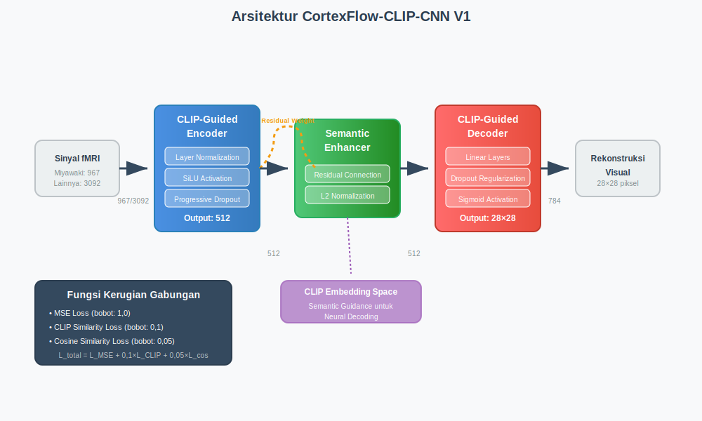
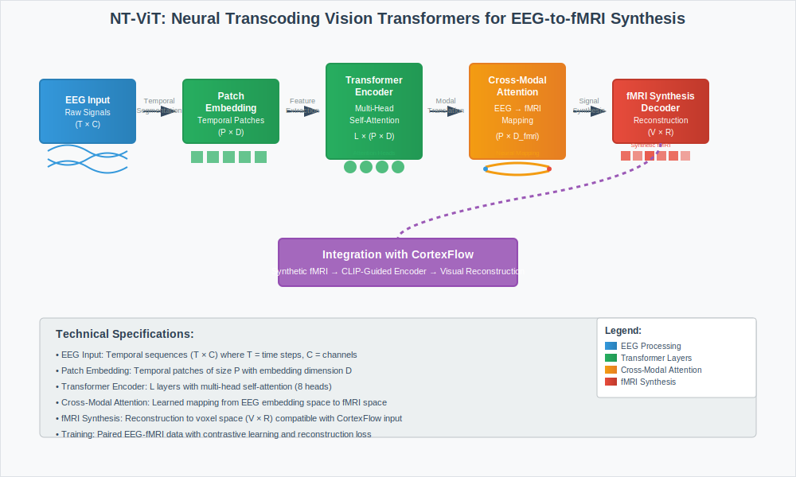

# METODE

## 3.1 Rancangan Penelitian dan Kerangka Eksperimen

Penelitian ini menggunakan rancangan eksperimental komparatif multi-modal untuk mengevaluasi kinerja model CortexFlow terhadap metode-metode pemecahan kode neural mutakhir menggunakan data fMRI dan EEG. Evaluasi dilakukan menggunakan kerangka kerja validasi silang berlapis sepuluh lipatan dengan pendekatan multi-dimensi yang mencakup kinerja rekonstruksi, efisiensi komputasi, dan dampak lingkungan sebagaimana ditunjukkan dalam metodologi komprehensif pada Gambar 2. Keunggulan utama penelitian ini adalah implementasi pendekatan multi-modal yang mengintegrasikan data fMRI dan EEG melalui neural transcoding NT-ViT, memberikan representasi neural yang lebih komprehensif.


**Gambar 1.** Arsitektur CortexFlow-CLIP-CNN V1 dengan tiga komponen utama: CLIP-Guided Encoder, Semantic Enhancer, dan CLIP-Guided Decoder.

Kerangka metodologi mengintegrasikan empat dataset neural decoding dengan karakteristik yang beragam, protokol prapemrosesan yang terstandardisasi, dan evaluasi komprehensif terhadap tiga metode pembelajaran mesin. Pendekatan ini memastikan validitas internal melalui kontrol eksperimental yang ketat dan validitas eksternal melalui penggunaan multiple dataset dengan kompleksitas yang bervariasi.


**Gambar 2.** Diagram alur metodologi eksperimen komprehensif dari input dataset hingga analisis hasil dan pelaporan.

## 3.2 Arsitektur dan Algoritma CortexFlow

Model CortexFlow merupakan arsitektur hibrid multi-modal yang menggabungkan panduan semantik berbasis CLIP dengan jaringan saraf konvolusional untuk pemecahan kode neural dari data fMRI dan EEG. Sebagaimana diilustrasikan dalam Gambar 1, arsitektur ini terdiri dari tiga komponen utama yang saling terintegrasi dengan kemampuan multi-modal.

### 3.2.1 Dasar Pemikiran Rancangan Arsitektur

**Rancangan Enkoder Terpandu CLIP:**
Enkoder terpandu CLIP dipilih berdasarkan kemampuan CLIP dalam menangkap hubungan semantik antara representasi visual dan tekstual. Komponen ini memetakan sinyal neural (fMRI asli atau fMRI sintetis dari EEG melalui NT-ViT) ke dalam ruang penyematan semantik CLIP menggunakan arsitektur berlapis dengan normalisasi lapisan dan fungsi aktivasi SiLU. Pemilihan fungsi aktivasi SiLU didasarkan pada kinerja superior dalam jaringan dalam dan sifat gradien halus yang mendukung pelatihan stabil.

**Strategi Integrasi Multi-Modal:**
Integrasi multi-modal dirancang untuk mengakomodasi heterogenitas antara sinyal fMRI dan EEG sambil mempertahankan konsistensi semantik. Transkoding NT-ViT memungkinkan unifikasi ruang representasi, sementara panduan CLIP memastikan penyelarasan semantik dengan target visual.

**Strategi Dropout dan Regularisasi:**
Komponen ini menerapkan dropout progresif untuk menjaga stabilitas pelatihan dan menghasilkan penyematan berukuran 512 dimensi yang sesuai dengan standar CLIP. Tingkat dropout spesifik dataset dioptimalkan berdasarkan ukuran sampel dan kompleksitas untuk keseimbangan antara kapasitas model dan pencegahan overfitting.

Modul peningkatan semantik bertugas meningkatkan kualitas representasi embedding melalui koneksi residual yang dapat disesuaikan sebagaimana ditunjukkan dalam jalur residual pada Gambar 1. Modul ini menggunakan bobot residual yang dioptimalkan secara spesifik untuk setiap dataset dan menerapkan normalisasi L2 untuk mempertahankan konsistensi embedding. Dekoder terpandu CLIP kemudian mengonversi embedding semantik menjadi keluaran visual menggunakan arsitektur linear berlapis dengan regularisasi dropout yang menghasilkan keluaran berukuran 28×28 piksel dengan fungsi aktivasi sigmoid.

Fungsi kerugian gabungan yang diterapkan mengintegrasikan tiga komponen utama untuk mengoptimalkan baik akurasi rekonstruksi maupun konsistensi semantik:

$L_{total} = w_{mse} \cdot L_{mse} + w_{clip} \cdot L_{clip} + w_{cos} \cdot L_{cos}$ (1)

dimana $L_{mse} = MSE(\hat{y}, y)$ adalah kerugian rekonstruksi, $L_{clip} = 1 - \cos(h_{res}, h_{clip})$ adalah kerugian kesamaan CLIP, dan $L_{cos} = 1 - \cos(h_{enc}, h_{res})$ adalah kerugian kesamaan kosinus. Bobot yang digunakan adalah $w_{mse} = 1,0$, $w_{clip} = 0,1$, dan $w_{cos} = 0,05$.

Modul Semantic Enhancer menerapkan koneksi residual adaptif dengan formula:

$h_{enhanced} = \alpha_{residual} \cdot h_{enc} + (1 - \alpha_{residual}) \cdot L_2(h_{enc})$ (2)

dimana $\alpha_{residual}$ adalah bobot residual yang dioptimalkan secara dataset-spesifik dan $L_2(\cdot)$ adalah normalisasi L2.

**Algoritma 1: Pelatihan CortexFlow**
```
Masukan: Dataset D, hiperparameter θ, model CLIP pra-terlatih
Keluaran: Model teroptimasi θ*

1. Inisialisasi E_θ, S_θ, D_θ, pengoptimal Adam
2. untuk epoch t = 1 hingga epoch_maksimum lakukan
3.   untuk setiap batch B dalam D lakukan
4.     h_enc ← E_θ(x_batch)
5.     h_res ← S_θ(h_enc) menggunakan Pers. (2)
6.     ŷ ← D_θ(h_res)
7.     L_total ← hitung kerugian menggunakan Pers. (1)
8.     θ ← pembaruan_Adam(θ, ∇L_total)
9.   akhir untuk
10.  jika kriteria_penghentian_dini maka berhenti
11. akhir untuk
12. kembalikan θ*
```

Model CortexFlow dioptimalkan secara individual untuk setiap dataset berdasarkan karakteristik data yang unik. Optimisasi hyperparameter dilakukan melalui pencarian sistematis dengan validasi silang untuk setiap dataset. Proses pelatihan mengikuti Algoritma 1 yang dirancang khusus untuk mengoptimalkan arsitektur CortexFlow dengan mengintegrasikan panduan semantik CLIP dengan pembelajaran residual adaptif (Persamaan 2). Algoritma ini mengoptimalkan fungsi kerugian gabungan (Persamaan 1) melalui backpropagation dengan optimizer Adam.

**Tabel 1: Konfigurasi Hyperparameter Dataset-Spesifik Multi-Modal**

| Parameter | Miyawaki (fMRI) | Vangerven (fMRI) | Crell (EEG→fMRI) | MindBigData (EEG→fMRI) | Deskripsi |
|-----------|-----------------|------------------|------------------|------------------------|-----------|
| Modalitas | fMRI | fMRI | EEG + NT-ViT | EEG + NT-ViT | Jenis data input |
| Dropout Encoder | 0,06 | 0,05 | 0,05 | 0,04 | Tingkat dropout pada layer encoder |
| Dropout Decoder | 0,02 | 0,015 | 0,02 | 0,02 | Tingkat dropout pada layer decoder |
| Bobot Residual CLIP | 0,1 | 0,08 | 0,08 | 0,05 | Koefisien koneksi residual |
| Laju Pembelajaran | 0,0003 | 0,0005 | 0,0008 | 0,001 | Laju pembelajaran untuk pengoptimal Adam |
| Ukuran Batch | 8 | 12 | 20 | 32 | Jumlah sampel per batch |
| Epoch Maksimum | 200 | 150 | 120 | 100 | Maksimum epoch untuk pelatihan |
| Kesabaran | 25 | 20 | 15 | 12 | Kesabaran penghentian dini |

Konfigurasi optimal bervariasi secara signifikan antardataset sebagaimana ditunjukkan dalam Tabel 1, dengan dataset yang lebih kecil seperti Miyawaki memerlukan dropout yang lebih tinggi untuk mencegah overfitting dan kesabaran yang lebih besar untuk stabilitas pelatihan. Dataset yang lebih besar seperti MindBigData menggunakan laju pembelajaran yang lebih agresif dan kesabaran yang lebih kecil untuk konvergensi yang efisien.

### 3.2.2 Strategi Optimisasi Hiperparameter

Optimisasi hiperparameter dilakukan melalui pendekatan sistematis berdasarkan karakteristik dataset dan arsitektur model. Strategi optimisasi mengikuti prinsip-prinsip berikut:

**Dasar Pemikiran Optimisasi Spesifik Dataset:**
- **Dataset kecil (Miyawaki, Vangerven):** Regularisasi agresif dengan dropout tinggi (0,05-0,06) dan kesabaran besar (20-25) untuk mencegah overfitting pada sampel terbatas
- **Dataset besar (Crell, MindBigData):** Laju pembelajaran lebih tinggi (0,0008-0,001) dan kesabaran kecil (12-15) untuk konvergensi efisien pada data berlimpah
- **Dataset multi-modal (Crell, MindBigData):** Bobot residual CLIP yang lebih rendah (0,05-0,08) untuk mengakomodasi kompleksitas tambahan dari transkoding neural

**Kriteria Konvergensi dan Penghentian Dini:**
Kriteria konvergensi yang ketat diterapkan dengan penghentian dini berdasarkan dataran kerugian validasi untuk memastikan model mencapai optimum lokal yang stabil tanpa overfitting. Pemantauan dilakukan terhadap MSE validasi dengan toleransi 1e-6 untuk deteksi peningkatan.

## 3.3 Dataset, Prapemrosesan, dan Metode Pembanding

Penelitian ini menggunakan pendekatan multi-modal dengan empat dataset pemecahan kode neural yang telah tervalidasi, mencakup data fMRI dan EEG sebagaimana ditampilkan dalam fase input dataset pada Gambar 2. Dataset Miyawaki dengan 119 sampel dan dimensi input 967 merepresentasikan data fMRI kompleksitas tinggi dalam rekonstruksi pola visual. Dataset Vangerven yang terdiri dari 100 sampel dengan dimensi input 3.092 memberikan representasi data fMRI kompleksitas sedang untuk pengenalan pola digit. Dataset Crell dengan 640 sampel dan dimensi input 3.092 menyediakan data EEG dengan tantangan kompleksitas tinggi dalam pemrosesan lintas modal. Dataset MindBigData dengan 1.200 sampel dan dimensi input 3.092 merepresentasikan data EEG berskala besar dengan kompleksitas sangat tinggi.

Salah satu kelebihan utama penelitian ini adalah implementasi pendekatan multi-modal yang mengintegrasikan data fMRI dan EEG untuk memberikan representasi neural yang lebih komprehensif. Untuk dataset EEG (Crell dan MindBigData), dilakukan proses neural transcoding menggunakan NT-ViT (Neural Transcoding Vision Transformers) sebagaimana dijelaskan detail dalam Section 3.3.1.

Protokol prapemrosesan yang konsisten diterapkan pada seluruh dataset dengan adaptasi khusus untuk modalitas yang berbeda sesuai dengan fase prapemrosesan data dalam Gambar 2.

**Prapemrosesan Data fMRI (Miyawaki, Vangerven):**
- Normalisasi z-score untuk standardisasi distribusi sinyal fMRI
- Deteksi dan penghapusan outlier menggunakan ambang batas tiga standar deviasi
- Spatial smoothing dengan Gaussian kernel untuk mengurangi noise
- Temporal filtering untuk menghilangkan drift sinyal

**Prapemrosesan Data EEG (Crell, MindBigData):**
- Band-pass filtering (0.5-50 Hz) untuk menghilangkan artifact
- Independent Component Analysis (ICA) untuk removal artifact mata dan otot
- Epoch extraction dan baseline correction
- Neural transcoding menggunakan NT-ViT (detail dalam Section 3.3.1)

### 3.3.3 Jaminan Kualitas Data dan Validasi

**Verifikasi Integritas Data:**
Pemeriksaan integritas data dan konsistensi format dilakukan secara sistematis untuk setiap dataset dan modalitas melalui jalur validasi otomatis:
- **Validasi format:** Verifikasi struktur berkas .mat dan bidang yang diperlukan (fmriTrn, stimTrn, fmriTest, stimTest)
- **Konsistensi dimensi:** Pemeriksaan otomatis untuk kompatibilitas dimensi masukan-keluaran
- **Validasi rentang:** Validasi statistik untuk rentang data dan sifat distribusi
- **Deteksi data hilang:** Identifikasi sistematis dan penanganan sampel yang hilang atau rusak

**Metrik Kontrol Kualitas:**
- **Rasio sinyal-ke-derau:** Dihitung untuk setiap dataset untuk menilai kualitas data
- **Deteksi pencilan:** Identifikasi pencilan statistik menggunakan aturan 3-sigma
- **Konsistensi lintas-modal:** Untuk dataset EEG, validasi kualitas transkoding NT-ViT
- **Konsistensi temporal:** Verifikasi preservasi struktur temporal dalam prapemrosesan

**Validasi Prapemrosesan:**
- **Verifikasi normalisasi:** Validasi statistik bahwa normalisasi z-score diterapkan dengan benar
- **Validasi penghapusan artefak:** Untuk data EEG, verifikasi efektivitas penghapusan artefak ICA
- **Kualitas transkoding:** Untuk data yang diproses NT-ViT, analisis korelasi dengan pola fMRI referensi

Penerapan benih acak yang identik (nilai 42) memastikan reproduksibilitas hasil di semua eksperimen sebagaimana ditekankan dalam metodologi konsisten pada Gambar 2.

### 3.3.1 Neural Transcoding dengan NT-ViT untuk Data EEG

Untuk dataset EEG (Crell dan MindBigData), implementasi NT-ViT (Neural Transcoding Vision Transformers) digunakan untuk melakukan sintesis EEG-to-fMRI yang memungkinkan unifikasi representasi neural. NT-ViT menggunakan arsitektur Vision Transformer yang dimodifikasi khusus untuk neural transcoding sebagaimana diilustrasikan dalam Gambar 3.


**Gambar 3.** Arsitektur NT-ViT (Neural Transcoding Vision Transformers) untuk sintesis EEG-to-fMRI dengan lima komponen utama: Patch Embedding, Transformer Encoder, Cross-Modal Attention, fMRI Synthesis Decoder, dan integrasi dengan CortexFlow.

**Arsitektur NT-ViT:**
```
EEG Input → Patch Embedding → Transformer Encoder →
Cross-Modal Attention → fMRI Synthesis Decoder → Synthetic fMRI Output
```

Proses neural transcoding mengikuti protokol berikut:
1. **Patch Embedding**: Sinyal EEG dipecah menjadi patch temporal dan disandikan ke dalam embedding space
2. **Transformer Encoding**: Multi-head self-attention untuk menangkap dependensi temporal dalam sinyal EEG
3. **Cross-Modal Attention**: Pembelajaran mapping antara representasi EEG dan fMRI melalui attention mechanism
4. **fMRI Synthesis**: Dekoder yang menghasilkan representasi fMRI sintetis dari embedding EEG

Parameter NT-ViT dioptimalkan menggunakan dataset paired EEG-fMRI untuk memastikan kualitas transcoding yang tinggi. Validasi transcoding dilakukan melalui korelasi spasial dan temporal antara fMRI asli dan fMRI sintetis.

### 3.3.2 Implementasi Metode Pembanding

Model Mind-Vis diimplementasikan berdasarkan spesifikasi dari publikasi CVPR 2023 dengan arsitektur yang menggabungkan modul pembelajaran kontrastif dengan embedding CLIP sebagaimana ditunjukkan dalam perbandingan metode pada Gambar 2. Model ini menggunakan protokol pelatihan multi-tahap dan memiliki jumlah parameter berkisar antara 316 hingga 320 juta parameter. Lightweight Brain-Diffuser menggunakan arsitektur dua tahap yang terdiri dari enkoder VDVAE pada tahap pertama dan dekoder difusi ringan pada tahap kedua dengan 157 hingga 159 juta parameter. Implementasi kedua metode pembanding mengikuti protokol standar dengan optimisasi yang konsisten untuk memastikan perbandingan yang adil.

## 3.4 Protokol Evaluasi dan Analisis Statistik

Strategi validasi menggunakan validasi silang berlapis sepuluh lipatan dengan benih acak yang konsisten pada nilai 42 di seluruh eksperimen sebagaimana diilustrasikan dalam fase validasi silang pada Gambar 2.

### 3.4.1 Rancangan Validasi Silang dan Partisi Data

**Implementasi K-Fold Terstratifikasi:**
Pembagian data dilakukan secara identik untuk semua metode dan dataset dengan protokol yang ketat untuk mencegah kebocoran data antarlipatan. Stratifikasi dilakukan berdasarkan distribusi target untuk mempertahankan representativitas setiap lipatan, dengan perhatian khusus pada:
- **Representasi seimbang:** Setiap lipatan mempertahankan proporsi yang sama dari variasi target
- **Konsistensi temporal:** Untuk dataset dengan struktur temporal, pembagian mempertahankan urutan kronologis
- **Keseimbangan lintas-modal:** Untuk dataset EEG (Crell, MindBigData), distribusi kualitas sinyal dijaga konsisten

**Pencegahan Kebocoran Data:**
Protokol pemisahan ketat diterapkan untuk memastikan tidak ada informasi dari set uji yang bocor ke proses pelatihan:
- **Isolasi prapemrosesan:** Parameter normalisasi dihitung hanya dari lipatan pelatihan
- **Isolasi hiperparameter:** Pemilihan model dilakukan menggunakan validasi silang bersarang pada lipatan pelatihan
- **Isolasi evaluasi:** Lipatan uji hanya digunakan untuk evaluasi akhir, tidak untuk pengembangan model

**Justifikasi Ukuran Sampel:**
Ukuran sampel untuk setiap dataset telah divalidasi melalui analisis daya untuk mendeteksi ukuran efek minimum d = 0,5 dengan daya 0,80. Ukuran dataset: Miyawaki (119), Vangerven (100), Crell (640), MindBigData (1200) memberikan daya yang memadai untuk inferensi statistik yang valid.

Evaluasi kinerja menggunakan metrik primer berupa Galat Kuadrat Rata-rata untuk mengukur akurasi rekonstruksi, Indeks Kesamaan Struktural untuk menilai kualitas struktural, dan Koefisien Korelasi Pearson untuk menganalisis korelasi linear sebagaimana ditampilkan dalam fase metrik evaluasi pada Gambar 2. Metrik sekunder mencakup waktu inferensi yang dirata-rata dari 100 eksekusi untuk memastikan konsistensi pengukuran, penggunaan memori GPU puncak untuk analisis efisiensi sumber daya, dan jejak karbon komputasi untuk evaluasi dampak lingkungan.

Pengujian hipotesis menggunakan hipotesis nol bahwa tidak terdapat perbedaan signifikan antara metode dan hipotesis alternatif bahwa CortexFlow menunjukkan kinerja yang lebih baik secara signifikan. Uji statistik menggunakan uji-t berpasangan untuk perbandingan dalam dataset dengan koreksi perbandingan berganda menggunakan metode Bonferroni.

### 3.4.2 Analisis Daya Statistik dan Ukuran Efek

**Kerangka Analisis Daya:**
Analisis daya statistik dilakukan untuk memastikan kecukupan sampel dalam mendeteksi perbedaan yang bermakna antara metode. Berdasarkan studi percontohan dan tinjauan literatur, ukuran efek minimum yang dianggap signifikan secara praktis ditetapkan pada Cohen's d = 0,5 (efek sedang). Analisis daya menggunakan α = 0,05 dan daya yang diinginkan = 0,80.

**Perhitungan dan Interpretasi Ukuran Efek:**
Ukuran efek dihitung menggunakan Cohen's d untuk menilai signifikansi praktis dengan interpretasi standar: kecil (d ≥ 0,2), sedang (d ≥ 0,5), dan besar (d ≥ 0,8). Interval kepercayaan 95% dihitung untuk semua estimasi ukuran efek menggunakan bootstrap terkoreksi bias dengan 1000 sampel ulang.

**Koreksi Perbandingan Berganda:**
Koreksi Bonferroni diterapkan untuk mengontrol tingkat kesalahan keluarga dalam perbandingan berpasangan berganda. Dengan 3 metode yang dibandingkan, menghasilkan 3 perbandingan berpasangan per dataset, sehingga α yang disesuaikan = 0,05/3 = 0,0167 per perbandingan.

**Validasi Asumsi Statistik:**
- **Normalitas:** Uji Shapiro-Wilk untuk residual (p > 0,05 diperlukan)
- **Homoskedastisitas:** Uji Levene untuk kesetaraan varians
- **Independensi:** Dipastikan melalui pemisahan lipatan validasi silang yang tepat

Kriteria signifikansi ditetapkan pada α = 0,05 dengan interpretasi effect size mengikuti konvensi Cohen. Semua eksperimen dilakukan pada sistem yang konsisten dengan spesifikasi NVIDIA RTX 3060 GPU 12 NVRAM, dan 32GB DDR4 RAM untuk memastikan konsistensi dan reproducibilitas hasil.

## 3.5 Metodologi Komputasi Hijau dan Analisis Efisiensi

Perhitungan jejak karbon mengintegrasikan karbon pelatihan dan karbon inferensi menggunakan formula komprehensif yang mempertimbangkan konsumsi daya spesifik hardware NVIDIA RTX 3060 GPU, waktu komputasi aktual, dan intensitas karbon grid listrik global. Metodologi ini memberikan penilaian yang akurat terhadap dampak lingkungan setiap metode sebagaimana diilustrasikan dalam fase analisis komputasi hijau pada Gambar 2. Jejak karbon total dihitung sebagai:

$C_{total} = C_{training} + C_{inference}$ (3)

dimana karbon emisi pelatihan dan inferensi masing-masing diformulasikan sebagai:

$C_{training} = \frac{P_{GPU} \times T_{training} \times I_{carbon}}{1000}$ (4)

$C_{inference} = \frac{P_{GPU} \times T_{inference} \times N_{inferences} \times I_{carbon}}{1000}$ (5)

dengan $P_{GPU} = 170W$ (konsumsi daya NVIDIA RTX 3060), $I_{carbon} = 0,5$ kg CO₂/kWh (rata-rata global), dan $N_{inferences} = 1000$ untuk penilaian operasional.

Metrik efisiensi karbon dan energi didefinisikan sebagai:

$E_{carbon} = \frac{Performance_{score}}{C_{total}}$ (6)

$E_{energy} = \frac{Throughput}{P_{GPU}}$ (7)

dimana $Performance_{score} = 1/MSE$ untuk normalisasi dan $Throughput$ adalah inferensi per detik.

Metodologi pengukuran efisiensi mencakup perhitungan efisiensi karbon menggunakan Persamaan 6, efisiensi energi berupa kecepatan inferensi per watt yang dikonsumsi menggunakan Persamaan 7, efisiensi sumber daya melalui optimisasi penggunaan memori, dan efisiensi deployment yang menilai kompatibilitas perangkat edge. Semua pengukuran dilakukan dengan protokol yang konsisten untuk memastikan perbandingan yang adil antara metode.
